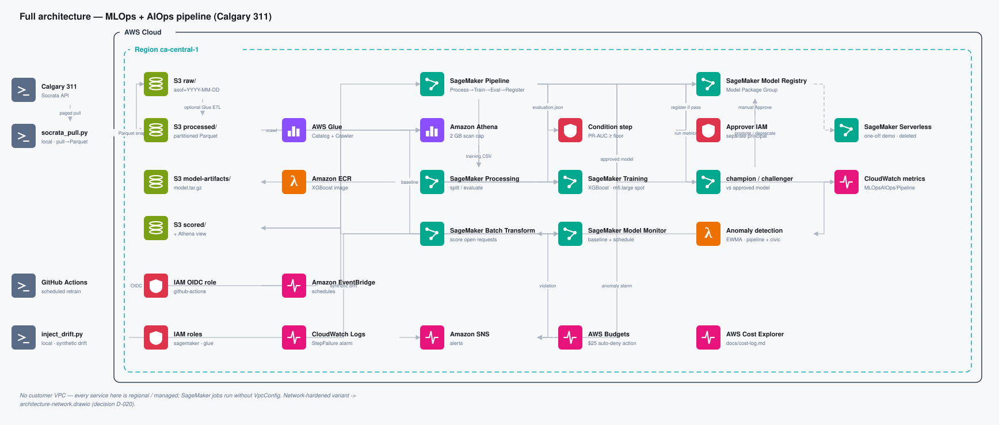

# mlops-aiops-pipeline

**From Data to Decisions — An MLOps + AIOps Pipeline on AWS**

An end-to-end, *operated* classical-ML pipeline on AWS SageMaker, built in the open as an
8-stage article series. One real AWS build per stage, one teaching article + architecture
diagram each, "failures you'll actually hit" framing. Written up outside this repo, in
`../output/stages/` — this repo is the pipeline code, not the article production.

**The question this pipeline answers:**

> When a Calgarian opens a 311 service request today, how likely is it to take longer than
> expected to resolve — and can we see that at intake instead of after the fact?

- **Data:** [City of Calgary 311 Service Requests](https://data.calgary.ca/Services-and-Amenities/311-Service-Requests/iahh-g8bj)
  (`iahh-g8bj`, ~7.5M rows, daily updates), pulled via the Socrata Open Data API.
- **Model:** per-request binary classification — will this request breach its category's
  proxy resolution-time threshold (per-`service_name` 75th percentile of `days_to_close`)?
- **Deploy:** SageMaker Batch Transform. No always-on endpoint; one short-lived
  Serverless Inference demo in Stage 6 (`scripts/serverless_demo.py`) measures real-time
  latency and cost for comparison, then deletes itself. `ci.yml` fails the build if
  endpoint-creation code appears anywhere else.
- **Cost:** ~$8 expected, **$25 hard cap on this project's cumulative spend** (tagged,
  before Free Tier credits), enforced by an AWS Budgets action that attaches a deny policy
  to the pipeline roles, plus an account-wide safety net that emails at $15 and $30 a month. All compute is job-based / ephemeral.

## Series index

Story-forward Medium headlines; the short name in brackets is the repo / diagram label.

**1. Nobody tells a Calgarian their request will take 90 days until it already has — ingesting five years of 311 data with AWS Glue and Athena** *(The Question & the Data)* — draft in `../output/stages/stage-1-question-and-data/article.md`
Frames the civic question up front before touching AWS. Pulls 5 years of Calgary 311 data via the Socrata API, lands it through a Glue ETL job into partitioned Parquet, and validates it with Athena queries.

**2. The seasonal pattern hiding in five years of Calgary's 311 calls — a first triage model with a SageMaker training job** *(Baseline Model)* — _pending_
Notebook exploration surfaces the seasonal patterns hiding in the data and builds a leakage-guarded, per-category breach label. Trains a first XGBoost model on a SageMaker Training Job and reports honest baseline metrics — modest but real predictive signal, not an inflated accuracy claim.

**3. A model that only works when I run it by hand isn't a pipeline — turning Calgary's 311 triage model into a SageMaker Pipelines DAG** *(From Notebook to Pipeline)* — _pending_
Turns the Stage 2 notebook into a real SageMaker Pipelines DAG (preprocess → train → evaluate), with parameterized, cacheable re-runs instead of hand-run scripts. Starts emitting operational metrics to CloudWatch that Stage 7's anomaly detector will later consume.

**4. Whose Calgary 311 request waits? — a governance gate with the SageMaker Model Registry** *(Model Registry & Governance Gate)* — _pending_
Adds a Model Registry with a metric-threshold condition step, so only models that clear a PR-AUC bar get registered. A separate IAM "approver" identity gates final approval — an explicit, documented separation of duties, not just a metric check.

**5. Retraining as Calgary's complaints roll in — champion/challenger with GitHub Actions and SageMaker** *(CI/CD: Automated Retraining)* — _pending_
A monthly scheduled GitHub Actions workflow (OIDC, no static credentials) re-pulls data and retrains a challenger model. It's promoted only if it genuinely beats the currently-approved champion past a guardband, preventing noise-driven flapping.

**6. Flagging today's most-likely-to-slip Calgary 311 requests, cheaply — SageMaker Batch Transform** *(Deployment)* — _pending_
Deploys the approved model via SageMaker Batch Transform to score today's open 311 requests — deliberately not a real-time endpoint, since nothing here needs sub-second latency. A short-lived Serverless Inference demo measures what real-time would cost and how fast it responds, then is deleted. Produces a ranked, queryable table of which open requests are most likely to breach, alongside a full cost receipt against the $25 cap.

**7. If a Calgary snowstorm breaks the model and nobody notices for a week, did governance even happen? — SageMaker Model Monitor + a pipeline-health anomaly detector (AIOps)** *(Watching the Watcher)* — _pending_
Two AIOps layers: SageMaker Model Monitor catching data drift on the model's inputs (framed as "citizen-feedback drift detection" — distinguishing an expected seasonal shift from a genuine new pattern in what residents are reporting), and a separate anomaly detector watching the pipeline's own health metrics. This is the layer most MLOps monitoring setups skip entirely, and the piece that makes the AIOps claim real rather than aspirational.

**8. What five years of Calgary 311 data said — and what the whole SageMaker pipeline cost to run** *(The Findings & the Pitch)* — _pending_
Synthesizes the civic insight (who waits longest and why), the final model numbers, total AWS spend against the cap, and an 8–10 item "failures you'll actually hit" retrospective. Closes with a narrative-only business pitch to a municipal 311 operations manager, explicitly disclaimed as no real business formed — genuinely useful directional intelligence, not a vetted policy recommendation.

Reference docs: [`docs/decisions.md`](docs/decisions.md) (locked decisions, ADR-lite),
[`docs/cost-log.md`](docs/cost-log.md) (running AWS spend receipt),
[`docs/model-card.md`](docs/model-card.md) (shipped in Stage 4),
[`docs/data-and-privacy.md`](docs/data-and-privacy.md),
[`docs/exploratory-findings.md`](docs/exploratory-findings.md) (pre-build data check).

## Architecture



*Auto-generated preview (plain category-coloured boxes, not the hand-tidied AWS-icon
version — that one lives in `../output/stages/architecture.drawio`, see below).*

Two diagrams, both generated by `code/scripts/architecture_gen.py` with official AWS-2024
resource icons and correct service-category colours (e.g. S3 = storage-green `#7AA116`,
white glyph). The script is here in the repo — reusable tooling; what it generates is
article content, so the actual `.drawio`/`.svg` files it writes land in
`../output/stages/` (a sibling of this repo, never committed — see D-025):

- **`architecture.drawio`** — the *default, deployed* build, cumulative per stage (9 pages:
  Full + Stage 1–8). No customer VPC — every service is regional/managed (S3, Glue, Athena,
  SageMaker jobs, CloudWatch, SNS, Budgets). This is what's actually running.
- **`architecture-network.drawio`** — the **VPC-hardened variant** (2 AZs, private
  subnets, VPC interface endpoints, no IGW/NAT). **Not deployed** — the enterprise pattern
  costs ~$44/month in endpoints alone, several times this project's $8 cap (see
  `docs/decisions.md` D-020) — but it's a first-class, intentionally-featured artifact: the
  answer to "how would you harden this for a real production workload?"

`../output/stages/articles/` is the publish-ready mirror — every article/outline numbered
together with its own diagram (`.md`/`.html`/`.drawio`/`.drawio.svg`), for handing off to
Medium. Tables in article text render as images, never HTML/markdown `<table>` markup —
Medium mangles it on paste (D-024) — via `code/scripts/table_gen.py` (also reusable
tooling that stays in the repo; its output goes to the same `../output/stages/` location).

## Repo layout

```
infra/        Terraform — the WHOLE stack, all 8 stages (later stages add .tf files here)
src/ingest/   Socrata paged pull, snapshot/replay, local Parquet conversion, Glue ETL
src/features/ leakage-guarded label + feature builders
src/pipeline/ SageMaker Pipeline DAG + step entrypoints        (Stage 3+)
src/promote/  champion/challenger promotion logic              (Stage 5)
src/deploy/   Batch Transform scoring                          (Stage 6)
src/monitor/  Model Monitor + pipeline anomaly detection       (Stage 7)
src/common/   config, CloudWatch metric emitters, Athena helper
notebooks/    Stage 2 exploration + baseline
tests/        unit tests (leakage guard, threshold math, promotion logic)
scripts/      nuke.sh teardown, explore_311.py exploratory queries,
              architecture_gen.py -> draw.io diagrams, table_gen.py -> table images,
              community_map.py -> community map (all three write to ../output/stages/,
              not into this repo), serverless_demo.py -> Stage 6 real-time demo
docs/         decisions, cost-log, model-card, data-and-privacy, exploratory-findings
```

Article drafts, per-stage runbooks, generated diagrams, and the publish-ready `articles/`
mirror all live in `../output/stages/` — outside this repo, never committed. This repo is
the pipeline code; the write-up is produced from it, not part of it.

## Quickstart (local)

```bash
uv sync
cp .env.example .env          # fill in bucket name + Socrata app token
uv run python -m src.ingest.socrata_pull pull   --years 5
uv run python -m src.ingest.socrata_pull to-parquet
uv run python -m src.ingest.socrata_pull snapshot --asof "$(date +%F)"
cd infra && terraform init && terraform apply
```

Full runbook: `../output/stages/stage-1-question-and-data/runbook.md`.

## License

Code: MIT (see [`LICENSE`](LICENSE)). Article text: © Collin Smith, all rights reserved.
Data: City of Calgary Open Data Terms of Use (attribution).
